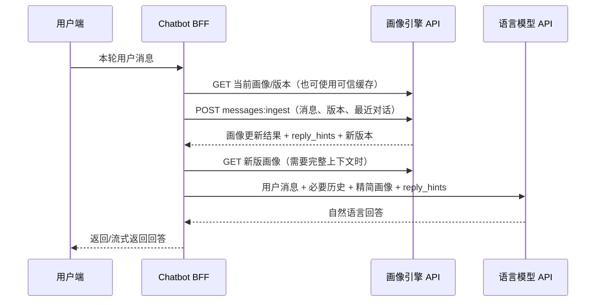

# Companion Profile Engine API 使用文档

本文依据 2026-08-01 的真实 FastAPI 路由与 Pydantic Schema 编写。交互式 OpenAPI 位于 `/docs`，Schema 位于 `/openapi.json`。

## 1. API 简介与 Chatbot 时序

该项目是“画像分析与维护 API”，不是聊天大模型 API。一个完整陪伴机器人通常由三部分组成：浏览器或 App、开发者自己的 Chat BFF、画像引擎；Chat BFF 还会单独连接一个大模型 API。**模型 API 与本项目 API 是两个不同服务、两套职责和两组凭据。**



推荐顺序：

1. `GET /v1/profiles/{user_id}` 读取当前画像和 `profile_version`；404 时调用 `POST /v1/profiles:init`。
2. 调用 `POST /v1/profiles/{user_id}/messages:ingest`，只传用户消息、当前版本、会话标识和必要的最近轮次。**不要传整份画像**，画像引擎会按租户和 `user_id` 从自己的数据库读取。
3. 画像引擎完成语义分析、硬规则校验和持久化，返回 `profile_patch`、`runtime_operations`、`reply_hints` 与新版本。它不直接返回最终聊天文本。
4. BFF 获取新版画像（或安全地合并返回的变更），仅挑选本轮必要字段，与 `reply_hints` 一起放入大模型系统上下文。
5. BFF 单独调用语言模型 API 生成自然语言回答，再返回用户。

画像引擎只摄取用户表达；`assistant_message` 不属于当前摄取 Schema。BFF 可把最近 user/assistant 历史映射到 `context.recent_turns`。`turn_id` 应同时映射为 `message_id` 和 `Idempotency-Key`，防止网络重试导致重复更新。

仓库内 `/demo` 页面就是上述编排的可运行 Demo：其后端 `/demo/api/chat` 先调用画像引擎，再读取更新后的画像和回答策略，最后调用界面所选的 DeepSeek、Claude、GPT、GLM、Gemini 或 Kimi 生成回复。所有模型均经 OpenRouter，浏览器不会直接持有画像 API Key 或模型 API Key。

## 2. 启动

### Windows PowerShell

```powershell
conda env create -p ./.conda-env -f environment.yml
conda run -p ./.conda-env pip install -e ".[dev]"
Copy-Item .env.example .env
conda run -p ./.conda-env alembic upgrade head
conda run --no-capture-output -p ./.conda-env profile-engine
```

### Linux/macOS

```bash
conda env create -p ./.conda-env -f environment.yml
conda run -p ./.conda-env pip install -e '.[dev]'
cp .env.example .env
conda run -p ./.conda-env alembic upgrade head
conda run --no-capture-output -p ./.conda-env profile-engine
```

检查：`curl http://localhost:8000/health`。Docker 本地入口也是 `http://localhost:8000`。Zeabur 地址由平台生成，不在代码中写死。

首次启动后执行完整验收，而不是只看进程是否存在：

```powershell
.\scripts\smoke-test.ps1 -BaseUrl "http://127.0.0.1:8000" -ApiKey "local-development-key" -TenantId "test-tenant"
```

Linux/macOS：

```bash
PROFILE_API_KEY=local-development-key PROFILE_TENANT_ID=test-tenant ./scripts/smoke-test.sh http://127.0.0.1:8000
```

成功标准是脚本退出码为 0、数据库状态为 `ok`。`PROFILE_SEMANTIC_EXTRACTOR=model` 时，必须配置 `PROFILE_OPENROUTER_API_KEY`、模型名和外部语义处理授权；消息请求可用 `model_provider=deepseek|claude|gpt|glm|gemini|kimi` 选择模型。`deterministic` 只用于无外部模型的回归和降级。

## 3. 鉴权与公共 Header

`GET /health`、页面和 OpenAPI 无需 API Key。所有核心 `/v1` 路由需要：

```http
X-API-Key: <tenant key>
X-Tenant-ID: demo-tenant
```

所有核心写操作还需要：

```http
Idempotency-Key: <同一逻辑请求稳定、不同请求唯一的值>
```

生产环境从 `PROFILE_TENANT_API_KEYS` JSON 按租户取密钥；`PROFILE_API_KEY` 的单一开发回退只在 `PROFILE_ENVIRONMENT=development` 生效。`/demo/api/*` 使用独立的 `X-Demo-Code`，不能替代核心 API Key。

以下示例公共变量：

```bash
BASE_URL=http://localhost:8000
API_KEY=local-development-key
TENANT_ID=test-tenant
```

## 4. 核心端点

### 健康检查

`GET /health`，无需鉴权。返回应用、数据库和版本，不返回密钥或画像。

```json
{"status":"ok","service":"companion-profile-engine","version":"0.2.0","services":{"application":"ok","database":"ok"}}
```

### 初始化画像

`POST /v1/profiles:init`。必填 `tenant_user_id`、`consent.profile`；生日、时区、显示名和已确认九型均可选。九型不会从普通对话自动分类。

```bash
curl -X POST "$BASE_URL/v1/profiles:init" \
  -H "X-API-Key: $API_KEY" -H "X-Tenant-ID: $TENANT_ID" \
  -H "Idempotency-Key: init-demo-xu" -H "Content-Type: application/json" \
  -d '{"tenant_user_id":"demo-xu","display_name":"Demo Xu","consent":{"profile":true,"sensitive_inference":false}}'
```

响应含 `request_id`、`profile_version: 1`、`rule_pack`、完整 `profile` 和 `warnings`。

### 读取画像

`GET /v1/profiles/{user_id}`。返回 `profile_version`、`profile` 和 `rule_pack_versions`；不存在为 404。

```bash
curl "$BASE_URL/v1/profiles/demo-xu" -H "X-API-Key: $API_KEY" -H "X-Tenant-ID: $TENANT_ID"
```

### 摄取一轮用户消息

`POST /v1/profiles/{user_id}/messages:ingest`。

```json
{
  "conversation_id": "session-001",
  "message_id": "turn-001",
  "expected_profile_version": 1,
  "occurred_at": "2026-08-01T12:00:00Z",
  "model_provider": "deepseek",
  "text": "以后回答短一点，先听我把话说完。",
  "context": {
    "topic": "communication",
    "previous_turn_count": 0,
    "recent_turns": []
  }
}
```

成功响应包括：新 `profile_version`、`semantic_frames`、候选/接受/拒绝特征信号、`profile_patch`、`runtime_operations`、`reply_hints`、`strategy_trace` 和 `no_profile_change`。版本冲突返回 409；同一幂等键与相同请求返回缓存结果。

### 解释画像

`GET /v1/profiles/{user_id}/explain?field=core_traits.energy_mode.extroversion`。`field` 可省略。返回支持/反证、版本历史；不会修改画像。

### 人工更正

`POST /v1/profiles/{user_id}:correct`：

```json
{"expected_profile_version":2,"target_path":"core_traits.energy_mode.extroversion","value":0.7,"reason":"用户明确更正"}
```

### 设置已确认九型

`POST /v1/profiles/{user_id}:set-enneagram`：

```json
{
  "expected_profile_version": 2,
  "enneagram": {
    "core_type": 7, "wing": 6,
    "primary_instinct": "SX", "secondary_instinct": "SO",
    "source": "expert_confirmed", "confidence": 0.95
  },
  "reason": "专家复核测评结果"
}
```

### 遗忘画像内容

`POST /v1/profiles/{user_id}:forget`。`scope` 为 `memory`、`evidence`、`birth_inference`、`enneagram` 或 `all_profile`；前两者必须给 `target_id`。

`all_profile` 会关闭该人物的后续画像推断；已关闭或撤回画像授权的人物不会继续出现在网站工作台的可聊天人物列表中。

```json
{"expected_profile_version":3,"scope":"memory","target_id":"mem_xxx","reason":"用户要求删除"}
```

### 重置 Demo 测试用户（本次新增）

`POST /v1/profiles/{user_id}:reset` 会删除同租户该用户的画像、证据、记忆、状态和对话，再以相同 `user_id` 创建空白 v1 画像。必须显式确认并提供幂等键。
该能力默认只在开发/测试环境开启；客户生产环境应保持 `PROFILE_ALLOW_PROFILE_RESET=false`。

```bash
curl -X POST "$BASE_URL/v1/profiles/demo-xu:reset" \
  -H "X-API-Key: $API_KEY" -H "X-Tenant-ID: $TENANT_ID" \
  -H "Idempotency-Key: reset-demo-xu-20260801" -H "Content-Type: application/json" \
  -d '{"confirm":true,"display_name":"Demo Xu"}'
```

### 当前规则包

`GET /v1/rule-packs/current` 返回发布版本、SHA-256、状态、校验报告和发布时间。

### 服务能力与版本协商

`GET /v1/capabilities` 返回服务版本、API v1、画像 Schema、当前规则包、功能开关和调用限制。B 端服务应在启动及部署切换后读取一次并记录版本，避免只根据网页或人工配置判断兼容性。

## 5. Demo 与专家工作台真实路由

以下均以 `/demo/api` 开头并要求 `X-Demo-Code`；它们服务于仓库内置页面，不是 Chat BFF 的核心依赖。

| 方法 | 路径 | 功能 |
| --- | --- | --- |
| POST | `/start` | 新建随机 Demo 人物与会话 |
| POST | `/chat` | 内置画像聊天（可选择 DeepSeek V3.2 或 Claude） |
| POST | `/workspace/bootstrap` | 初始化团队与模板人物 |
| GET/POST | `/people` | 列表/创建人物 |
| GET | `/people/{user_id}` | 人物详情 |
| POST/GET | `/people/{user_id}/conversations` | 创建/列出会话 |
| GET | `/people/{user_id}/conversations/{conversation_id}/messages` | 消息列表 |
| GET | `/people/{user_id}/profile-explain` | 工作台解释与审计 |
| POST | `/people/{user_id}/manual-edit` | 专家人工编辑 |
| POST | `/people/{user_id}/enneagram` | 专家九型编辑 |
| GET | `/rules/workspace` | 规则工作区 |
| GET | `/rules/revisions/{revision_id}` | 修订详情 |
| GET | `/rules/revisions/{revision_id}/documents/{asset}` | 规则文档 |
| POST | `/rules/documents/parse`、`/dump` | 文档/结构转换 |
| POST/PUT | `/rules/drafts`、`/rules/drafts/{revision_id}` | 草稿创建/保存 |
| POST | `/rules/revisions/{id}/submit|approve|publish|rollback` | 审批发布流 |
| GET | `/rules/compare` | 修订比较 |
| POST | `/rules/test` | 隔离规则测试 |
| POST | `/members` | 团队成员管理 |

请求细节以 `/openapi.json` 为最终机器可读来源。

## 6. 关键数据模型

- `user_id`/`tenant_user_id`：租户内稳定用户标识；不是会话 ID。
- `conversation_id`：一段连续会话；多个会话可属于同一用户。
- `message_id`：本轮用户消息唯一 ID；BFF 使用 `turn_id`。
- `expected_profile_version`：乐观并发控制，必须等于当前版本。
- `profile.runtime.current_state`：有 TTL 的短期状态。
- `profile.runtime.interaction_preferences`：从明确表达形成的沟通偏好。
- `profile.runtime.memories`：仍有效的长期事实/事件。
- `profile.meta.overall_confidence`、各画像项 `confidence`/`evidence_refs`：置信与依据。
- `profile_patch`：本轮稳定画像变化；`runtime_operations`：偏好、状态、记忆操作。
- `model_reply_guidance` 是模型提出的本轮建议；`reply_hints` 是合并硬规则后的最终策略。`reply_hints.rule_locked_fields` 列出的字段已经由画像、交互偏好或当前状态规则锁定，Chatbot 不应再让回答模型覆盖这些字段。

## 7. JavaScript 与 Python 最小示例

下面前半段是画像 API 的最小调用。生产 Chatbot 应在**服务端**执行它，不要把画像 Key 放进网页代码。

```js
const headers = { 'X-API-Key': apiKey, 'X-Tenant-ID': tenantId };
const current = await fetch(`${baseUrl}/v1/profiles/${userId}`, { headers }).then(r => r.json());
const update = await fetch(`${baseUrl}/v1/profiles/${userId}/messages:ingest`, {
  method: 'POST',
  headers: { ...headers, 'Idempotency-Key': turnId, 'Content-Type': 'application/json' },
  body: JSON.stringify({ conversation_id: sessionId, message_id: turnId,
    expected_profile_version: current.profile_version, occurred_at: new Date().toISOString(),
    model_provider: 'deepseek', text: userMessage, context: { recent_turns: [] } })
}).then(r => r.json());

// 画像引擎返回策略与画像变更，不返回最终聊天文本。
const latest = await fetch(`${baseUrl}/v1/profiles/${userId}`, { headers }).then(r => r.json());
const llmContext = {
  reply_hints: update.reply_hints,
  current_state: latest.profile.runtime.current_state,
  interaction_preferences: latest.profile.runtime.interaction_preferences,
  portrait_essence: latest.profile.portrait?.essence?.content,
};
// 接下来由 BFF 使用“另一套模型 API Key”调用所选语言模型：
// messages = [system(JSON.stringify(llmContext)), ...recentTurns, user(userMessage)]
```

```python
import datetime, httpx
headers = {"X-API-Key": api_key, "X-Tenant-ID": tenant_id}
current = httpx.get(f"{base_url}/v1/profiles/{user_id}", headers=headers).json()
update = httpx.post(
    f"{base_url}/v1/profiles/{user_id}/messages:ingest",
    headers={**headers, "Idempotency-Key": turn_id},
    json={"conversation_id": session_id, "message_id": turn_id,
          "expected_profile_version": current["profile_version"],
          "occurred_at": datetime.datetime.now(datetime.timezone.utc).isoformat(),
          "model_provider": "deepseek", "text": user_message,
          "context": {"recent_turns": []}},
).json()

latest = httpx.get(f"{base_url}/v1/profiles/{user_id}", headers=headers).json()
llm_context = {
    "reply_hints": update["reply_hints"],
    "current_state": latest["profile"]["runtime"]["current_state"],
    "interaction_preferences": latest["profile"]["runtime"]["interaction_preferences"],
}
# 使用独立的模型客户端和模型 API Key，以 llm_context 生成最终回答。
```

如需完整可运行的“画像引擎 + OpenRouter 模型回答”组合示例，直接查看 `/demo` 页面及 `src/profile_engine/demo.py` 的 `/demo/api/chat` 实现。

## 8. 画像写入硬边界

- 模型只能返回结构化候选，不能直接写数据库。
- 长期特质目标必须是已发布规则中完整覆盖的 17 个字段之一；支持原文必须逐字存在，并与同一片段的合格语义帧对应。
- 回复长短、先共情、幽默程度等机器人交互指令只更新 `runtime.interaction_preferences`，不能修改长期性格。
- 当前压力、精力等只更新带 TTL 的 `runtime.current_state`；身份事实、事件、引用、假设也不能越权写长期特质。
- 单条行为、重复行为和明确自述使用不同可靠度与单轮限幅；重复行为必须达到独立会话门槛。
- 规则编译和专家发布都会验证长期维度、行为场景、语言板块、MBTI 维度、运行时字段与更新操作目标。悬空字段、漏配字段和冲突路由会阻止发布。

## 9. 错误与重试

| HTTP | 代码/形态 | 原因 | 重试 |
| ---: | --- | --- | --- |
| 401 | `detail: invalid API key` | Key/租户错误或生产未配置租户 Key | 修正配置后 |
| 403 | `consent_required` | 未授权画像或敏感推断 | 需用户授权，不自动重试 |
| 404 | `not_found` | 用户/画像不存在 | 可先初始化 |
| 409 | `profile_version_conflict` | 并发导致版本过期 | 重新读取后最多重试一次 |
| 429 | `tenant rate limit exceeded` | 租户超过每分钟调用限制 | 按 `Retry-After` 等待 |
| 422 | FastAPI 校验或 `invalid_operation` | 缺 Header、字段非法、复用幂等键到不同 body | 修正请求，不盲重试 |
| 503 | `semantic_extractor_unavailable` | 外部语义提取不可用 | 有限退避重试 |

常见问题：画像为空通常是未初始化或用户/租户不一致；画像未更新可能是 `no_profile_change=true`、版本冲突或未获得相应授权。限制注入长度应在 BFF 做字段白名单和字符上限，HIWM 默认 `PROFILE_CONTEXT_MAX_CHARS=8000`。
